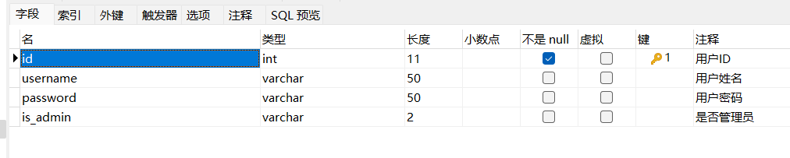

# microDbUtil

>一个利用实体类作为参数操作数据库的微型JDBC工具类

### 简介

​		在Java实训时候使用到数据库，因为涉及多个表需要写多条SQL语句。因此编写了该工具类。

​		实现原理：使用反射获取类名作为表名，将查询出来的数据(结果集)转换成实体类List。使用HashMap传递where条件。

​		只合适的简单的数据库操作！！！

### 优势

- 只需要提供实体类即可对应表进行查询、插入、更新、删除操作，无需编写SQL语句

### 使用示例

#### 1.首先编写实体类

- 实体类名与数据库表名一致
- 实体类成员变量与数据库表字段名和类型一致
- 实体类需`Get`和`Set`方法

例如：



```java
public class User {
    private int id;
    private String username;
    private String password;
    private String is_admin;

    public int getId() {
        return id;
    }

    public void setId(int id) {
        this.id = id;
    }

    public String getUsername() {
        return username;
    }

    public void setUsername(String username) {
        this.username = username;
    }

    public String getPassword() {
        return password;
    }

    public void setPassword(String password) {
        this.password = password;
    }

    public String getIs_admin() {
        return is_admin;
    }

    public void setIs_admin(String is_admin) {
        this.is_admin = is_admin;
    }

    @Override
    public String toString() {
        return "User{" +
                "id=" + id +
                ", username='" + username + '\'' +
                ", password='" + password + '\'' +
                ", is_admin='" + is_admin + '\'' +
                '}';
    }
}
```

#### 2.将工具类导入工程(工程里面的Utils文件DBmysql、ResultSetUtils)

#### 3.实例化DBmysql类，填写MySQL数据库URL、用户名、密码

#### 4.参考代码（即工程中DBmysqlTest）#注意Java SDK版本

```JAVA
public class DBmysqlTest {
    static String datebase = "librarymanagement";
    static String url = "jdbc:mysql://localhost:3306/" + datebase + "?useUnicode=true&characterEncoding=utf-8";
    static String username = "root";
    static String password = "";
    DBmysql dBmysql = new DBmysql(url,username,password);
    @Test
    public void select() {
        //无条件查询
        List<User> list = dBmysql.select(User.class);
        list.forEach(obj->System.out.println(obj.toString()));
    }

    @Test
    public void testSelect() {
        //条件查询，目前只能AND
        Map map = new HashMap();
        map.put("username = ","root"); //条件一
        //map.put("id =",1);             //条件二
        List<User> list = dBmysql.select(User.class,map);
        list.forEach(obj->System.out.println(obj.toString()));
    }

    @Test
    public void insert() {
        //插入数据
        User user = new User();
        user.setUsername("xiaoming");
        user.setPassword("123456");
        int upDateCount = dBmysql.insert(User.class,user);
        System.out.println("更新"+upDateCount+"行");
    }

    @Test
    public void update() {
        /* 更新数据 */
        //1.获取数据
        User user = null;
        Map map = new HashMap();
        map.put("username = ","xiaoming");
        user = (User) dBmysql.select(User.class,map).get(0);
        //2.修改数据
        user.setPassword("123");
        //3.更新数据
        int upDateCount = dBmysql.update(User.class,user,"username"); //username为使用表字段username作为条件
        System.out.println("更新"+upDateCount+"行");
    }

    @Test
    public void delete() {
        /* 删除数据 */
        //1.添加条件
        Map map = new HashMap();
        map.put("username = ","xiaoming");
        //2.删除数据
        int upDateCount = dBmysql.delete(User.class,map);
        System.out.println("更新"+upDateCount+"行");
    }
}
```


